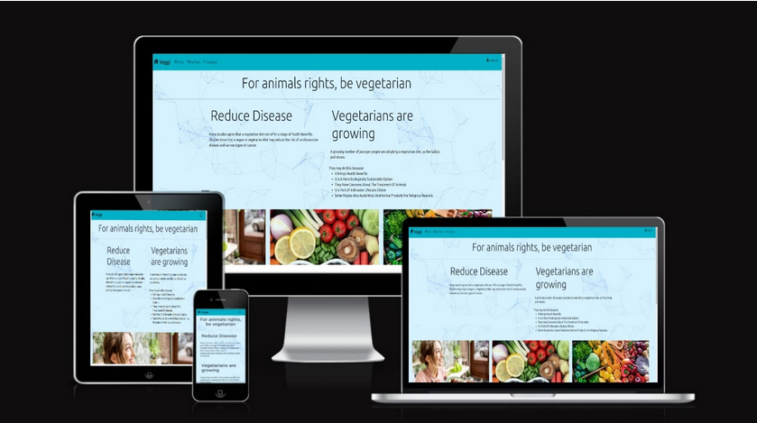
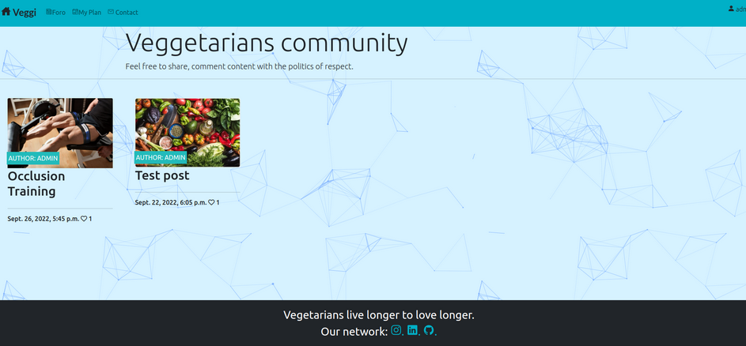
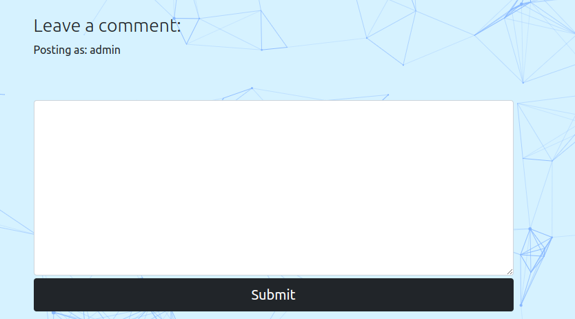

# veg community
<br>

**Developer: Julio David Hernandez**
User created to see the basical functions:

user : usertest
pw : 123prove321

[Live Website](https://ci-pp4-djangopy.onrender.com/)
<!-- https://djangoapp4.herokuapp.com/ -->


<hr>

## Table of Contents
  - [About](#about)
  - [User Goals](#user-goals)
  - [Site Owner Goals](#site-owner-goals)
  - [User Experience](#user-experience)
  - [User Stories](#user-stories)
  - [Design](#design)
    - [Colours](#colours)
    - [Fonts](#fonts)
    - [Structure](#structure)
      - [Website pages](#website-pages)
      - [Database](#database)
    - [Wireframes](#wireframes)
  - [Technologies Used](#technologies-used)
  - [Features](#features)
  - [Validation](#validation)
  - [Testing](#testing)
    - [Manual testing of user stories](#manual-testing-of-user-stories)
    - [Automated testing](#automated-testing)
    - [Performing tests on various devices](#performing-tests-on-various-devices)
    - [Browser compatibility](#browser-compatibility)
  - [Bugs](#bugs)
  - [Configuration](#configuration)
  - [Credits](#credits)
  - [Acknowledgements](#acknowledgements)
<hr>

### About

Veg community is a community website where the users can get a weekly planner and interact in a community blog.
- With two types of accounts
    - An administrator user account
    - A normal user account
<hr>

### User Goals

- See the plan at any time
- Be able to plan their meals
- See the Foro at any time
- Be able to Comment the posts

<hr>

### Site Owner Goals

- Supply an online community for users.
- Furnish an online solution for users to plan their weekly meals.
- Produce visually attractive design
- Provide full responsive application with comfortable navigation
<hr>

## User Experience
<hr>

### Target Audience

- People who want to set an organized meals planer.
- Vegetarian enthusiasts who wish to be part of a community.
- People who desire to keep track of their meals.
- people who require to follow a meal planer
<hr>

### User Requirements and Expectations

- Fluent navigation.
- Practical use.
- A responsive application that permits the users to access their diet program on any device.
- Attractive design for different screen size.
- Functions and Links  working as hoped-for.
- Easy method to contact with the developer
- Simple methodology to be use the application

##### Back to [top](#table-of-contents)


## User Stories
<hr>

### Users

Like user I want to:

1.  See the home page, a minimal design.
2.  Be able to navigate to different pages in the application.
3.  Register and acquire an account.
4.  Planing a weekly diet.
6.  Delete my plan as requested.
7.  To see my current plans at any time.
5.  Edit items from my current plans at any point.
8.  Delete items from my current plans at any point.
9.  Interact with the community.
10. Log in to the app to use the different services
<hr>

### Site Owner

As a site Owner, I want:

11. Every customer to be able to view the articles of the blog.
12. Only the logged-in users to be able to create their plans.
13. Users to be able to manage their plan like needed.
14. Database entry to be validated on sign-up page.
15. User to come to a error page for a URL that does not exist.
16. Users be able to get in contact by our networks.
17. The site is responsive.


##### Back to [top](#table-of-contents)

<hr>

## Design

### Colours

The color tones were chosen precisely to match the concept and to a simple and approachable design using the Visual Studio colors preset.
Constituted by a combination of three colors to realize a fluent UX design 

<details><summary>Black Color</summary>

</details>
<details><summary>Blue Color</summary>

</details>

<details><summary>Orange Color</summary>

</details>

<details><summary>Color Picker</summary>

</details>
<hr>

### Fonts

ROBOTO Font from GOOGLE. The most used on the majority of data flow.
<hr>

### Structure

#### Website pages


Following the principles of UXD (user experience design), the website structure was designed to be fluid and simple to operate. The website was composed of a page with:

  - The website consists of the following sections:
  - The Home page and six interactive pages.
  - The Community Blog.
  - The Personal Planer.
  - Footer with social media developer.
  - Plan page allowing user to create a diet meal.
  - Plan page where user can see all their diet meal.
  - Plan page where user can edit an existing diet meal.
  - Delete plan, allowing user to delete selected diet meal.
  - Blog page where showed the posts.
  - Blog page where user can see a description and comment.
  - Register page to sign up a new user on the website.
  - Login page to log in user on the website.
  - Logout page to log out user of the website.
  - 404 error page.
<hr>

#### Database

- The backend consists in the use of Django framework based in python with a database of a Postgres Elephant SQL for the deployed version.
- Consist in five database models, all fields are stored in the database structure stored in the Postgres database.

The following models represent the database model structure of the website:

<details><summary>Show diagram</summary>

</details>

<hr>

##### User Model
- The User model is part of the Django allauth library and was represented as hypothetical.
<hr>

##### Post Model
- The Post model contains the fields: title, slug, author, updated_on , content, featured_image, exerpt, created_on, status, likes
- The model has a one-to-one relationship with User
- The image field contains the Blog image.
<hr>

##### Comment Model

- The Comment model contains the fields: post , name, email, body, created_on, approved.
- The model has a one-to-one relationship with Post
<hr>

##### Week Model
- The Week model contains the following fields:  weeknumber, status, title, slug, period, created_on, featured_image.
- The model has a one-to-one relationship with User
- The Week model was designed to grow the planner in a future to develop a monthly planer.

<hr>

##### Day Model

- The Day model contains the following fields: week_owner. title, slugday, day_name, phrase, featured_image, status.
- The model has a one-to-one relationship with Week.
<hr>

##### Meal Model
- The model contains the following fields: owner, day, title, slugmeal, meal_description, featured_image, created_on.
- The model has a one-to-one relationship with User
- The Meal model contains the body type category for an exercise

<hr>

### Wireframes

<details><summary>Laptop & Desktop</summary>

</details>
<details><summary> Mobile & Smartphone </summary>

</details>

##### Back to [top](#table-of-contents)
<hr>

## Technologies Used
<hr>

### Languages & Frameworks

- HTML
- CSS
- Bootstrap
- Javascript
- Python
- Django
- giref==3.5.2

<hr>

### Libraries & Tools

-  dj-database-url 1.0
-  Django 3.2.15
-  django-allauth 0.51.0
-  django-cloudinary-storage 0.3.0
-  django-crispy-forms 1.14.0
-  django-summernote 0.8.20.0
-  gunicorn 20.1.0
-  oauthlib 3.2.1
-  psycopg2 2.9.3
-  PyJWT 2.5.0
-  python3-openid 3.2.0
-  pytz 2022.2.1
-  requests-oauthlib 1.3.1
-  sqlparse 0.4.2
-  types-cryptography 3.3.23
- [Git](https://git-scm.com/) To have a version control
- [GitHub](https://github.com/) To store The Git Data
- [Herooku](https://dashboard.heroku.com) was used to deploy the project into live environment
- [Postgres SQL](https://www.elephantsql.com/) – To Save Postgres database
- [Cloudinary](https://cloudinary.com/) cloudinary-storage 0.0.6
- [Summernote](https://summernote.org/) To use field in forms page
- [Visual Studio Code](https://code.visualstudio.com/) & [GitPod](https://www.gitpod.io/) Edit code
- [Favicon.io](https://favicon.io) To Create the site favicon
- [Google Fonts](https://fonts.google.com/) To Set the fonts
- [WireFrame](https://wireframepro.mockflow.com/) To Design the wireframes
- [Dbdiagram.io](https://dbdiagram.io) Used for the database schema diagram

- Validation:

  - [WC3 Validator](https://validator.w3.org/) to validate the html Files
  - [Jigsaw W3 Validator](https://jigsaw.w3.org/css-validator/) to validate the css Files
  - [Wave Validator](https://wave.webaim.org/) to check accessibility
  - [Lighthouse](https://developers.google.com/web/tools/lighthouse/) to check performance web apps
  - [JShint](https://jshint.com/) to validate JavaScript Files
  - Pylint Flake8 to check Python Files

##### Back to [top](#table-of-contents)

<hr>

## Features
<hr>

### Navigation Bar

- Featured can be accessed at the all pages
- The nav bar includes links to Home, Foro, Planner and contact us pages.
  - Logged-in users will see their name right in the nav bar with option to click to log out
  - Not logged-in users have the option to register or log in
- The nav bar is responsive to changes to a toggle on smaller size screens
- The navbar permits user to move in the various sections on the website

- User stories covered: 2

<details><summary>Nav Bar</summary>


</details>

<hr>

### Home page

- Home page includes nav bar, main body and a footer.
- Main body changing to the different urls by extend function of django.
- User stories covered: 1

<details><summary>Home Page</summary>

</details>

<hr>

### Footer
- A footer is displayed at the base template, it will be shown at bottom in each page
- Contains network links to get ion contact.
- User stories covered: 16

<details><summary>Footer</summary>

</details>

<hr>

### Sign up / Register

- Everyone can create an account.
- when the users are log-in, log-out & sign-up will be notified by alert message.
- User stories covered: 3

<details><summary>Sign Up</summary>

</details>

<hr>

### Login

- Sign Up users can log-in to their account.
- To log in the user have to type their credentials.
- User and Password Fields are mandatory.
- When user is logged will be able to use the planner page.
- User stories covered: 10, 14.

<details><summary>Login</summary>

</details>

<hr>

### Sign Out
- Confirmation screen for Logged in user to logout from their account 

<details><summary>Sign Out</summary>


</details>
<hr>

### Planner page

- Logged-in users can interact with the database.
- User stories covered: 4, 5, 6, 7, 8, 12, 13

<details><summary>Planer</summary>


</details>

<hr>

### Add meal in the plan

- Users can plan their weekly meals 
- Users can add a meal in their weekly plan
- User stories covered: 4, 5

<details><summary>Add Meal item</summary>


</details>

<hr>

### Delete meals in the plans

- Users can delete their meals on the days.
- User can delete by a button like minimal design.
- User stories covered: 1, 4, 8.

<details><summary>Delete Meal item</summary>

</details>

<hr>

### Edit plan
- User can edit a selected day diet
- This can be done by clicking the icon edit from the item icons
- User can edit any meal item and save once edited
- User is provided with a feedback message that their meal has been edited
- User stories covered: 5

<details><summary>Edit Section</summary>


</details>

<hr>

### Foro page

- Page show the articles list published in the database.
- Guest able to see the article detail and likes number.
- User stories covered: 11.

<details><summary>Foro page</summary>



</details>

<hr>

### Articles detail page

- Provides overview of the article.
- Guest can view a detailed description likes and comments in the articles.
- User stories covered: 9
  
<details><summary>Post detail</summary>


</details>

<hr>

### Comment form

- Comment form to let a comment in the particular article.
- User stories covered: 9.

<details><summary>Comment form</summary>



</details>
<hr>

### Error pages

- If the user has no premises to access, the 403-page will show
- If a user goes to no exist link, the error page will display 404
- If the user fills a form wrong,  will display error-500 page
- User stories covered: 15, 17

<details><summary>Error page</summary>


</details>

##### Back to [top](#table-of-contents)
<hr>

## Validation

The W3C Markup Validation Service was used to validate the HTML of the website.
<details><summary>Home</summary>

</details>

<details><summary>Planner</summary>

</details>

<details><summary>Foro</summary>

</details>

<details><summary>Contact us</summary>

</details>

<details><summary>Log in</summary>

</details>

<details><summary>Log out</summary>

</details>

<details><summary>Sign Up</summary>

</details>

<details><summary>Error page</summary>

</details>

<hr>

### CSS Validation

The W3C Jigsaw CSS Validator Service validate the CSS of the website, it passed without errors.

<details><summary>W3C jigsaw </summary>

</details>
<hr>

### JavaScript Validation

JSHint Service was used to validate the Javascript files without errors.

<details><summary> JSHint</summary>

</details>
<hr>

### Python Validation

To validate python was used two services Pylint, Flake8.

- Pylint is a static code analyser for Python 2 or 3. The latest version supports Python 3.7.2 and above.

- Flake8 is a popular lint wrapper for python. Under the hood, it runs 

three other tools and combines their results: pep8 for checking style. pyflakes for checking syntax. mccabe for checking complexity.


<details><summary>Home</summary>


<details><summary>view.py</summary>

</details>
</details>

<details><summary>Foro</summary>

<details><summary>Admin.py</summary>

</details>

<details><summary>apps.py</summary>

</details>

<details><summary>forms.py</summary>

</details>

<details><summary>Models.py</summary>

</details>

<details><summary>Urls.py</summary>

</details>

<details><summary>Views.py</summary>

</details>

</details>

<details><summary>Planner</summary>

<details><summary>Admin.py</summary>

</details>

<details><summary>apps.py</summary>

</details>

<details><summary>Forms.py</summary>

</details>

<details><summary>Models.py</summary>

</details>

<details><summary>Urls.py</summary>

</details>

<details><summary>Views.py</summary>

</details>

</details>

<hr>

### Chrome Dev Tools Lighthouse

Lighthouse was used to test the performance, accessibility, best practice and SEO of the site.
Overall the results are very good for the 4 values.
<hr>

#### Desktop
<details><summary>View results</summary>

<details><summary>Contact Us</summary>

</details>

<details><summary>Home</summary>

</details>

<details><summary>Meals</summary>

</details>

<details><summary>Planer</summary>

</details>

<details><summary>Posts</summary>

</details>

<details><summary>Error Pages</summary>


</details>
</details>

<hr>

#### Mobile
<details><summary>View results</summary>

<details><summary>Contact Us</summary>

</details>

<details><summary>Home</summary>

</details>

<details><summary>Meals</summary>

</details>

<details><summary>Planer</summary>

</details>

<details><summary>Posts</summary>

</details>

<details><summary>Error Pages</summary>


</details>

</details>
</details>
<hr>

### Wave
The WAVE WebAIM web accessibility evaluation tool was used to test the websites accessibility.

<details><summary>Home wave</summary>


</details>

<details><summary>Planer</summary>

<details><summary>Days list</summary>

</details>

<details><summary>Meals</summary>

</details>

</details>

<details><summary>Foro</summary>

<details><summary>Post List</summary>

</details>

<details><summary>Post Details</summary>

</details>

</details>

<details><summary>Contact us</summary>

</details>
</details>

<details><summary>Error pages </summary>


</details>
##### Back to [top](#table-of-contents)

<hr>

## Testing

The testing approach is as follows:
1. Manual testing of user stories
2. Automated testing
<hr>

### Manual testing of user stories

1.  See the home page, a minimal design.

**Step** | **Expected Result** | **Actual Result**
------------ | ------------ | ------------ |
Navigate to https://djangoapp4.herokuapp.com// | Home page load | Works as expected |

<details><summary>Home</summary>

</details>

2.  Be able to navigate to different pages in the application.


**Step** | **Expected Result** | **Actual Result**
------------ | ------------ | ------------ |
Use options from navigation var | Navigate around the pages  | Works as expected |

<details><summary>Nav Bar</summary>

</details>


3. Register and acquire an account.

**Step** | **Expected Result** | **Actual Result**
------------ | ------------ | ------------ |
Navigate to https://djangoapp4.herokuapp.com/accounts/signup/ | Register/SignUp Page | Works as expected |

<details><summary>Register/SignUp</summary>

</details>

4. Planing a weekly diet.

**Step** | **Expected Result** | **Actual Result**
------------ | ------------ | ------------ |
Navigate to https://djangoapp4.herokuapp.com/planer/ | Planer page load with all week days| Works as expected |

<details><summary>Week</summary>

</details>

5. Edit items from my current plans at any point.

**Step** | **Expected Result** | **Actual Result**
------------ | ------------ | ------------ |
Use the edit function on the items | Edit view load | Works as expected |

<details><summary>Edit</summary>


</details>

6. Delete my plan as requested.

**Step** | **Expected Result** | **Actual Result**
------------ | ------------ | ------------ |
Use the delete function on the items | Delete funciton load | Works as expected |

<details><summary>Delete</summary>

</details>

7. To see my current plans at any time.

**Step** | **Expected Result** | **Actual Result**
------------ | ------------ | ------------ |
Get my planer | Load planer view | Works as expected |

<details><summary>Screenshot</summary>

</details>

8. Delete items from my current plans at any point.

**Step** | **Expected Result** | **Actual Result**
------------ | ------------ | ------------ |
view delete function on the items | Delete items | Works as expected |

<details><summary>Delete items</summary>


</details>

9. Interact with the community.

**Step** | **Expected Result** | **Actual Result**
------------ | ------------ | ------------ |
Comment form | Comment submited as user | Works as expected |


<details><summary>Comment Posts</summary>

</details>

10. Log in to the app to use the different services

**Step** | **Expected Result** | **Actual Result**
------------ | ------------ | ------------ |
Navigate to https://djangoapp4.herokuapp.com/accounts/login/ | Log In as User| Works as expected |


<details><summary>Login</summary>

</details>

11. Every customer to be able to view the articles of the blog.

**Step** | **Expected Result** | **Actual Result**
------------ | ------------ | ------------ |
Navigate to https://djangoapp4.herokuapp.com/posts/ | Foro Page load | Works as expected |

<details><summary>Foro</summary>

</details>

12. Only the logged-in users to be able to create a Meal in their plans.

**Step** | **Expected Result** | **Actual Result**
------------ | ------------ | ------------ |
https://djangoapp4.herokuapp.com/planer/add_meals | users can create a meal item| Works as expected |

<details><summary>Add page</summary>

</details>

13. Users to be able to manage their plan like needed.

**Step** | **Expected Result** | **Actual Result**
------------ | ------------ | ------------ |
Functions views | The users can Add Delete and edit meals items| Works as expected |

<details><summary>Functons </summary>


</details>

14. Database entry to be validated on sign-up page.

**Step** | **Expected Result** | **Actual Result**
------------ | ------------ | ------------ |
Navigate to https://djangoapp4.herokuapp.com/accounts/signup/| Get the Sign Up notification | Works as expected |

<details><summary>Screenshot</summary>

</details>

15. user to come to a error page for a URL that does not exist.

**Step** | **Expected Result** | **Actual Result**
------------ | ------------ | ------------ |
Navigate to Wrong url inside the page | 404 page error Load | Works as expected |
Navigate in a page without have the permit| 403 page error Load | Works as expected |
Fill and submit wrong a form | 500 page error Load | Works as expected |


<details><summary>Error pages</summary>


</details>

16. users be able to get in contact by our networks.

**Step** | **Expected Result** | **Actual Result**
------------ | ------------ | ------------ |
Go to footer in  https://djangoapp4.herokuapp.com/ | Network links | Works as expected |

<details><summary>Network links</summary>

</details>

17. The site is responsive.

**Step** | **Expected Result** | **Actual Result**
------------ | ------------ | ------------ |
Navigate to pages | Responsive in different screens size | Works as expected |

<details><summary>Responsive</summary>


</details>
<hr>

### Automated testing

Automated testing was done using the Django's unit tests from a Python standard library module: unittest. The reports were produced using the coverage tool.

<details><summary>Test</summary>

</details>

<hr>

### Performing tests on various devices

The website was tested using Google Chrome Developer Tools Toggle Device Toolbar to simulate viewports of different devices.

The website was tested on the following devices:
- Lenovo legion (Big Screen)
- Samsung Galaxy Tab A (Medium screen)
- Hawei p40 (Small screen)
<hr>

### Browser compatibility

| [](http://godban.github.io/browsers-support-badges/)<br/>IE / Edge | [](http://godban.github.io/browsers-support-badges/)<br/>Firefox | [](http://godban.github.io/browsers-support-badges/)<br/>Chrome | [](http://godban.github.io/browsers-support-badges/)<br/>Safari | [](http://godban.github.io/browsers-support-badges/)<br/>Opera |
| --------- | --------- | --------- | --------- | --------- |
| IE11, Edge| last 2 versions| last 2 versions| last 2 versions| last 2 versions

##### Back to [top](#table-of-contents)

<hr>

## Bugs

| **Bug** | **Fix** |
| ------- | ------- |
|    Edit function   | Give the right parameter to save form       |
|    Render Template    | Give Multiple parameters by url |
|         | |

##### Back to [top](#table-of-contents)

<hr>

## Configuration
<hr>

### Deploy Application 

<hr>

#### Create a Database

- Database Create an elephant SQL
- Go to Elephant SQL and crew a new instance.
- select a server
    <details>
    <summary>Create Database</summary>
    
    
    
    
    </details>
- Get Database Environment Url
  <details><summary>Get Database URL</summary>
  
  </details>
<hr>

#### Cloudinary

Create a cloudinary Acount and get the environment Url
  <details><summary>Get Cloudinary environment variable</summary>
  
  </details>

<hr>

#### Config Django App

- Add installed App cloudinary.
- config static files with cloudinary.
  <details><summary>Create Env.py.</summary>  </details>
- Create a procfile and add " web: gunicorn name_of_main_app.wsgi".
- collect statics in Django project.
- Generate requirements by freeze command.

<hr>

#### Heroku Deployment


1. Create an account in heroku.com
2. Create a new app, give it a distinctive name, and select your location.
  - <details><summary>Create App</summary>  </details>
  - <details><summary>Select server</summary>  </details>
3. Go to Heroku aplication deployment.
4. Select Deployment method and conect with GitHub.
  - <details><summary>Git hub</summary>  </details>
5. Go settings select  buildpacks. For the project 'python'.
  - <details><summary>Buildpacks</summary>  </details>
6.  Go to Config and Env vars set with the environment vars gotten in the previus steps
  - <details><summary>Config vars</summary>  </details>

7. Choose the branch at the end of deployment section.
8. Await the app's construction. When everything is deployed, you will see the message "App was successfully deployed" and a "View" button that will lead you to your deployed link.
  - <details><summary>Deploy branch</summary>  </details>

<hr>

### Forking the GitHub Repository

1. Go to the GitHub repository https://github.com/jdhernandezS1/CI_PP4_DjangoPY
2. Click on Fork button in top right corner
3. You will then have a copy of the repository in your own GitHub account.

<hr>

### Clone the GitHub Repository

To clone the repository:
- In the Github repository
1. Locate the button __Code__ in the right uper corner. 
2. Chose between HTTPS, SSH, Github CLI or download zip.
3. Open Git Terminal (Bash).
4. Go to the directory where you want to cloned the file.
6. Use command Git clone and paste the URL.
```bash
git clone https://github.com/jdhernandezS1/CI_PP4_DjangoPY.git
```   
Online view [link_to_page](https://ci-pp3-lib.herokuapp.com/)

##### Back to [top](#table-of-contents)

<hr>

## Credits

- Code institute 
- icons source : https://ionic.io/ionicons
- w3schools  
- freepng.es
- herokuapp
- GitHub

<hr>

### Images

Images Sources:
- fabicons
- freepng
- ionicons


##### Back to [top](#table-of-contents)
<hr>

## __License__

- CI_PP4_DjangoPY is an open source project by [CI_PP4_DjangoPY](https://github.com/jdhernandezS1/CI_PP4_DjangoPY) that is licensed under [OPS](https://opensource.org/).
- CI_PP4_DjangoPY reserves the right to change the license of future releases.

<hr>

## Acknowledgements

Cordially thanks to: 

- HashEm to bless me.
- My Family to support me.
- My mentor Mo Shami.
- Guys of Stack overflow.
- Code Institute Academy